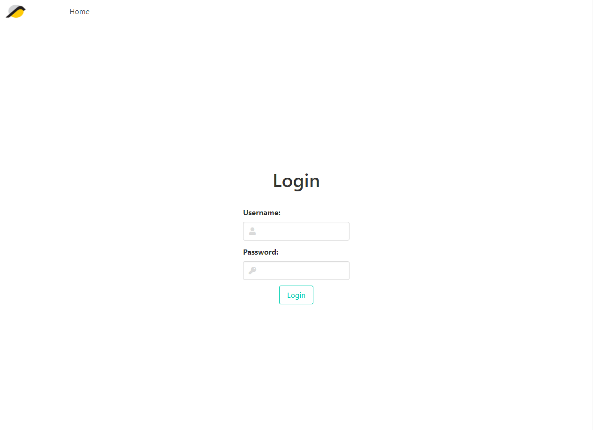
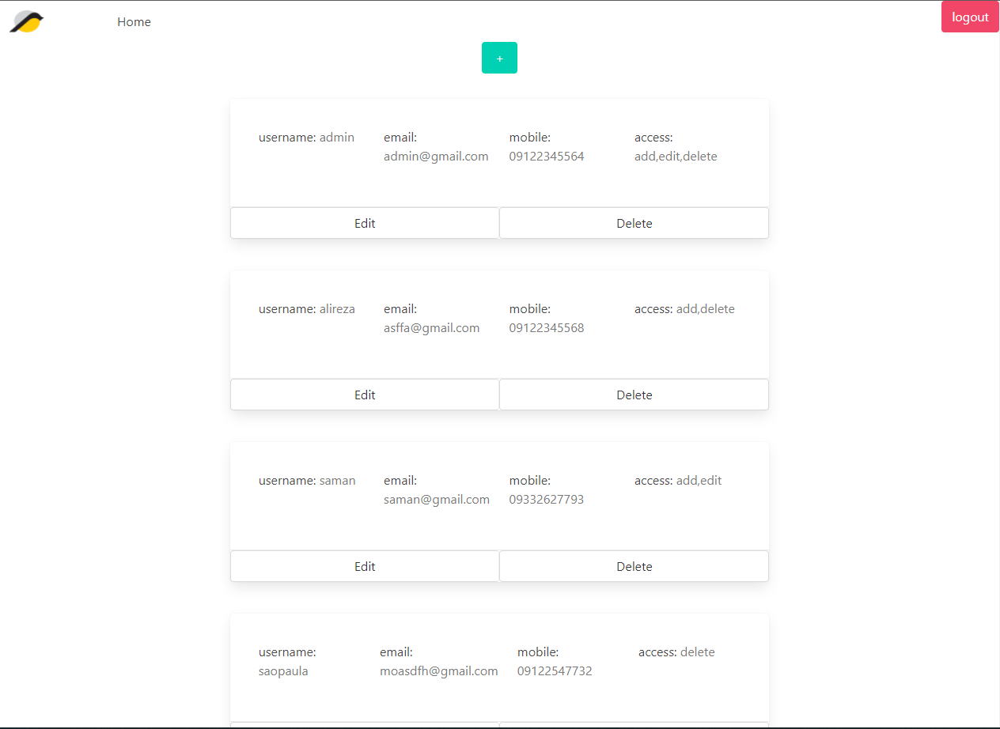
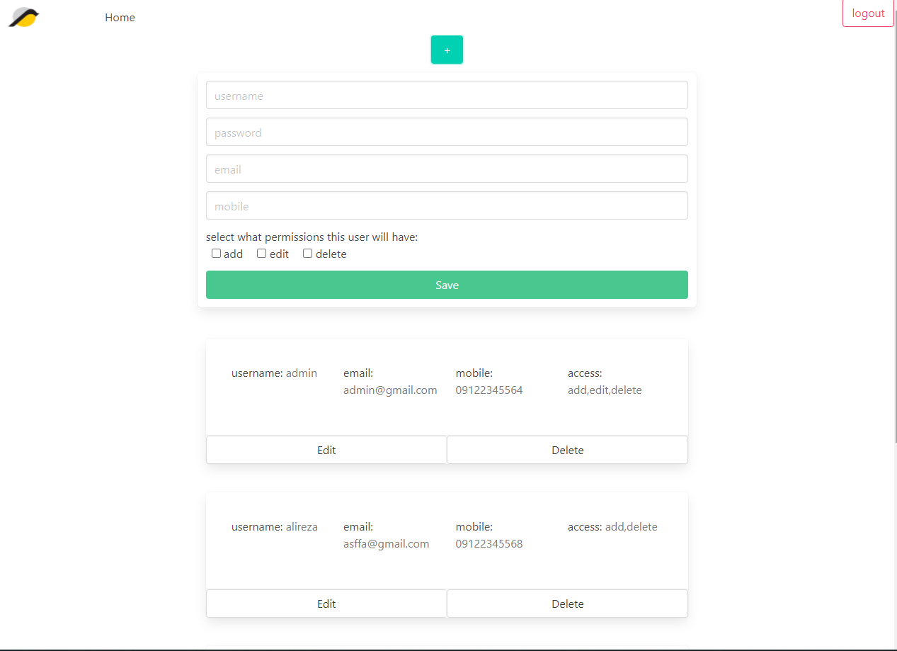
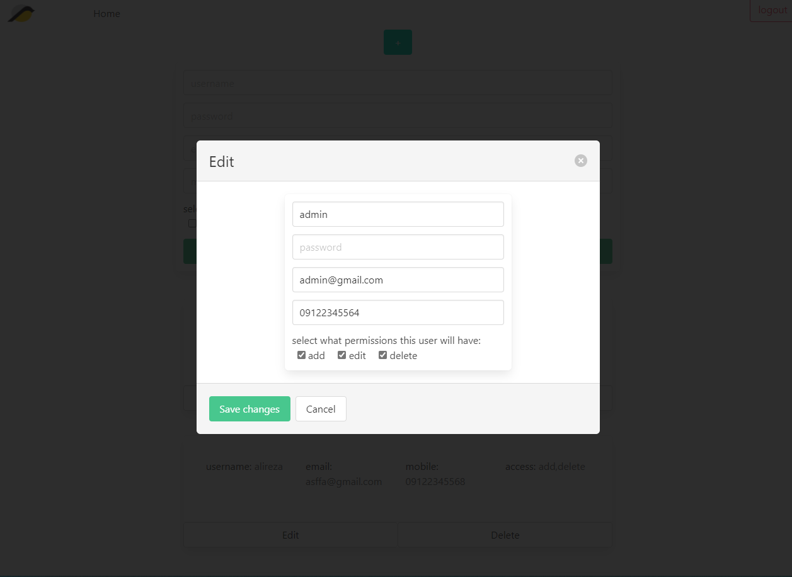
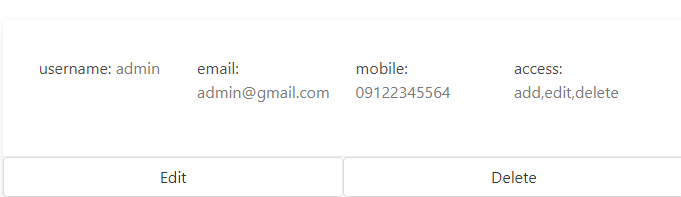

# BayaWeb

### simple authorization system for bayaweb       
#
> note: this application has two versions which you can check out to their branches:
- [GUI Based branch](https://github.com/mrRamezanzad/bayaweb/tree/frontend)
- [API Based branch](https://github.com/mrRamezanzad/bayaweb/tree/main)
---
> note: in order for app to work make a `.env` file and set application configs there.  
> alterntive to that you may use `./configs/config.dev.js` or `./configs/config.prod.js` files.
## Techs: 

- express
- express-validator
- JWT, Session & Cookies
- mongoDB & mongoose

## Login Section

## Dashboard
this dashboard is used to:
- view all users.

- create new user. 

- update selected user.

- delete unwanted user.

---
> ### Thank you for your time. ❤️ XOXO 